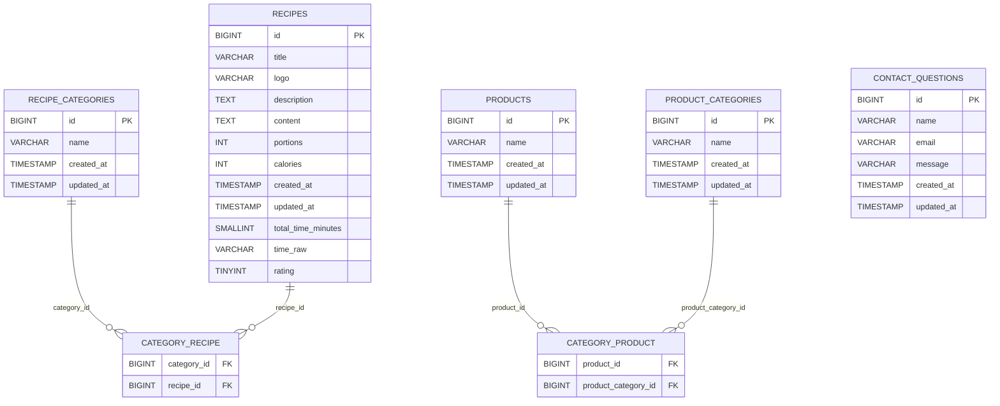

# DB Schema

```mermaid
erDiagram
    RECIPE_CATEGORIES {
        BIGINT id PK
        VARCHAR name
        TIMESTAMP created_at
        TIMESTAMP updated_at
    }

    RECIPES {
        BIGINT id PK
        VARCHAR title
        VARCHAR logo
        TEXT description
        TEXT content
        INT portions
        INT calories
        TIMESTAMP created_at
        TIMESTAMP updated_at
        SMALLINT total_time_minutes
        VARCHAR time_raw
        TINYINT rating
    }

    PRODUCTS {
        BIGINT id PK
        VARCHAR name
        TIMESTAMP created_at
        TIMESTAMP updated_at
    }

    PRODUCT_CATEGORIES {
        BIGINT id PK
        VARCHAR name
        TIMESTAMP created_at
        TIMESTAMP updated_at
    }

    CATEGORY_PRODUCT {
        BIGINT product_id FK
        BIGINT product_category_id FK
    }

    CATEGORY_RECIPE {
        BIGINT category_id FK
        BIGINT recipe_id FK
    }

    CONTACT_QUESTIONS {
        BIGINT id PK
        VARCHAR name
        VARCHAR email
        VARCHAR message
        TIMESTAMP created_at
        TIMESTAMP updated_at
    }

    PRODUCTS ||--o{ CATEGORY_PRODUCT : product_id
    PRODUCT_CATEGORIES ||--o{ CATEGORY_PRODUCT : product_category_id
    RECIPE_CATEGORIES ||--o{ CATEGORY_RECIPE : category_id
    RECIPES ||--o{ CATEGORY_RECIPE : recipe_id
```

Nullable: `recipes.logo`, `recipes.portions`, `recipes.calories`.
